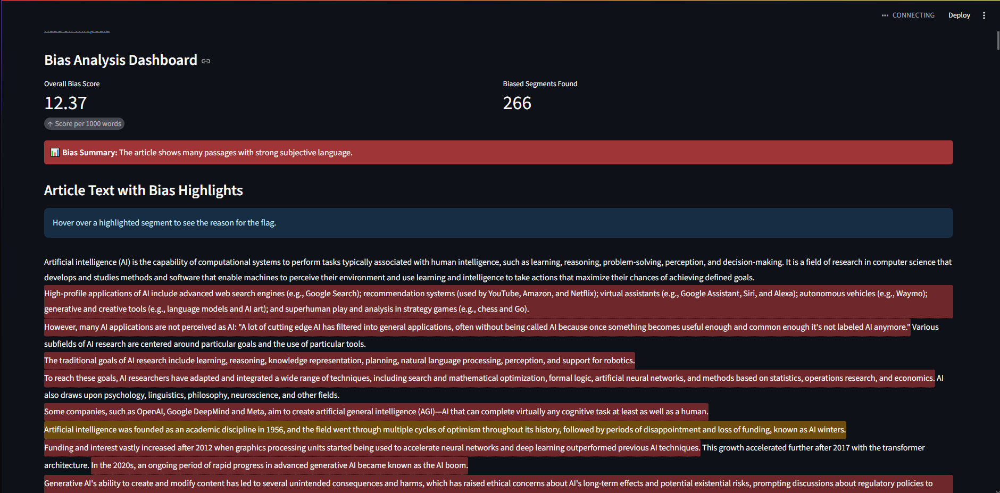

# Analisador de Viés (Bias Analyzer)

Este projeto contém uma aplicação web construída com Streamlit e conteinerizada com Docker. A aplicação foi projetada para analisar artigos do Wikipedia e identificar possíveis vieses.
Exemplo de relatório:[Relatório](<Bias_Report_Artificial intelligence.pdf>)


---

## 🚀 Como Executar o Projeto

Para executar esta aplicação no seu ambiente local, irá precisar do Docker e do Docker Compose. O processo foi simplificado para que possa começar com um único comando.


### Pré-requisitos

Certifique-se de que tem os seguintes softwares instalados na sua máquina:

* **[Docker](https://www.docker.com/get-started)**
* **[Docker Compose](https://docs.docker.com/compose/install/)** (geralmente já vem incluído com o Docker Desktop)

### Passos para a Execução

1.  **Clone o Repositório**
    Clone este repositório para a sua máquina local.
    ```bash
    git clone <URL_DO_SEU_REPOSITORIO>
    ```

2.  **Navegue até a Pasta do Projeto**
    Abra um terminal e navegue até o diretório raiz do projeto que acabou de clonar.
    ```bash
    cd <NOME_DA_PASTA_DO_PROJETO>
    ```

3.  **Construa e Inicie os Contêineres**
    Execute o seguinte comando. Ele irá construir a imagem Docker (se ainda não tiver sido construída) e iniciar a aplicação.
    ```bash
    docker-compose up --build
    ```
    * A flag `--build` garante que a imagem Docker é construída com base na versão mais recente do seu `Dockerfile`.
    * Na primeira vez, este processo pode demorar alguns minutos, pois irá descarregar as imagens base e instalar todas as dependências. Nas execuções seguintes, será muito mais rápido graças ao cache do Docker e as otimizações de build por camada.

---

## 🖥️ Acesso à Aplicação

Após o comando `docker-compose up` ser concluído com sucesso, a aplicação Streamlit estará a ser executada e acessível no seu navegador.

* Abra o seu navegador e aceda a: **[http://localhost:8501](http://localhost:8501)**

---

## ⚙️ Desenvolvimento

Este ambiente está configurado para desenvolvimento com *live-reload*. Graças à configuração de volumes no ficheiro `docker-compose.yml`, qualquer alteração que fizer nos ficheiros dentro da pasta `src` na sua máquina local será refletida instantaneamente na aplicação em execução no contêiner.

O Streamlit irá detetar a alteração e perguntar se deseja recarregar a página para ver as suas atualizações.


### **Resumo Formal do Algoritmo de Detecção de Viés**

O sistema de detecção de viés implementado no script `HybridBiasDetector` utiliza uma abordagem híbrida, combinando duas metodologias distintas para identificar sentenças potencialmente tendenciosas em um texto. O processo é executado em nível de sentença, aplicando uma estratégia de duas fases para maximizar a cobertura e a precisão da detecção.

As duas principais fases da análise são:

#### **Fase 1: Análise de Subjetividade por Machine Learning (ML)**

Nesta etapa inicial, o algoritmo emprega um modelo de linguagem pré-treinado da arquitetura BERT (especificamente, `cffl/bert-base-styleclassification-subjective-neutral`). A função primária deste modelo é realizar uma classificação binária em cada sentença, determinando se o seu conteúdo é **Subjetivo** (opinativo) ou **Neutro** (factual).

* Uma sentença é submetida ao modelo, que retorna um rótulo (`SUBJECTIVE` ou `NEUTRAL`) e um *score* de confiança associado.
* Se o rótulo for `SUBJECTIVE` e o *score* de confiança exceder um limiar pré-configurado (o `threshold`, com valor padrão de 0.4), a sentença é imediatamente classificada como um segmento de viés.
* A justificativa para a marcação é registrada como "Linguagem Subjetiva", e o algoritmo avança para a próxima sentença, não aplicando a segunda fase de análise a esta.

#### **Fase 2: Análise Lexical Baseada em Palavras-Chave**

Caso uma sentença não seja classificada como subjetiva pelo modelo de Machine Learning, ela é submetida a uma segunda verificação, de natureza lexical. Esta fase utiliza dois conjuntos de palavras predefinidas para identificar tipos específicos de viés editorial:

1.  **"Peacock Terms" (Termos "Pavão"):** Refere-se a um léxico de adjetivos e termos grandiosos que promovem um tema com elogios, mas sem fornecer evidências concretas (ex: "extraordinário", "obra-prima", "revolucionário"). A presença de qualquer uma dessas palavras em uma sentença resulta na sua marcação.

2.  **"Weasel Words" (Termos "Doninha"):** Corresponde a um léxico de palavras e frases evasivas ou ambíguas, que criam uma impressão de autoridade ou significância sem se comprometer com a veracidade da afirmação (ex: "supostamente", "alguns sugerem", "é considerado"). A detecção desses termos também leva à marcação da sentença.

### **Fluxo Operacional do Algoritmo**

O processo completo pode ser descrito da seguinte forma:

1.  **Inicialização:** O detector carrega o modelo de ML e os léxicos de palavras-chave.
2.  **Segmentação:** O texto de entrada é dividido em uma lista de sentenças individuais.
3.  **Processamento Iterativo:** O algoritmo itera sobre cada sentença da lista.
4.  **Análise por ML:** Cada sentença é primeiramente analisada pelo modelo BERT. Se for identificada como subjetiva acima do limiar, é adicionada à lista de resultados e o processo continua para a próxima sentença.
5.  **Análise Lexical:** Se a sentença não for marcada na etapa anterior, ela é então verificada contra os léxicos de "Peacock" e "Weasel words". Se houver uma correspondência, a sentença é adicionada à lista de resultados com a devida justificativa.
6.  **Consolidação:** Ao final da iteração, o algoritmo retorna uma lista completa contendo todos os `BiasSegment` (segmentos de viés) que foram identificados em qualquer uma das duas fases.

Essa abordagem híbrida permite que o sistema combine a compreensão contextual e semântica do modelo de Machine Learning com a precisão de uma análise baseada em regras (léxicos), resultando em um mecanismo de detecção de viés mais robusto e abrangente.

## Propostas de Melhoria
1. Arquitetura e Qualidade de Código
 - Infraestrutura como Código (IaC): Implementar a infraestrutura com Terraform para realizar a implantação da aplicação na AWS, utilizando o serviço ECS (Elastic Container Service).

 - CI/CD: Implementar CI/CD 

 - Manutenibilidade: Realizar a refatoração do código para aprimorar sua clareza, manutenibilidade e escalabilidade.

 - Testes Unitários: Implementar testes unitários para a camada de domínio, garantindo a robustez e o comportamento esperado das regras de negócio.

 - Padronização de Código: Adotar o uso de pre-commit hooks para automatizar a verificação e formatação do código, assegurando a conformidade com as regras predefinidas do projeto.

2. Algoritmo de Detecção
 - Cálculo de Pontuação: Aprimorar o Overall Bias Score para que a pontuação pondere melhor a densidade de viés em relação ao comprimento do texto. O objetivo é tornar a métrica mais estável e comparável entre artigos de tamanhos diferentes.

 - Unificação das Abordagens: Integrar os resultados da análise lexical e do modelo de machine learning. O objetivo é que a detecção de uma palavra-chave (ex: "obra-prima") possa modular o score de subjetividade da sentença, gerando uma análise de viés mais precisa e unificada.

 - Expansão dos Léxicos: Realizar um estudo aprofundado em um corpus de artigos de tecnologia para identificar novos termos e padrões de linguagem que indiquem viés, expandindo e refinando os léxicos de "Peacock" e "Weasel words".
